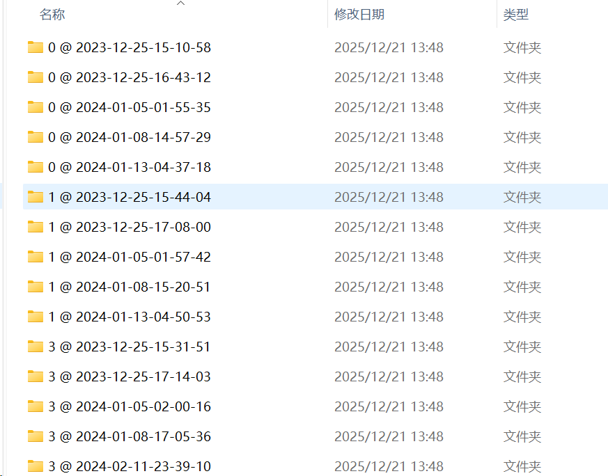
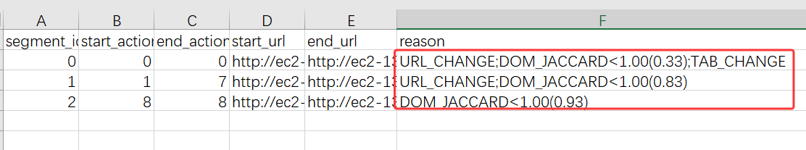
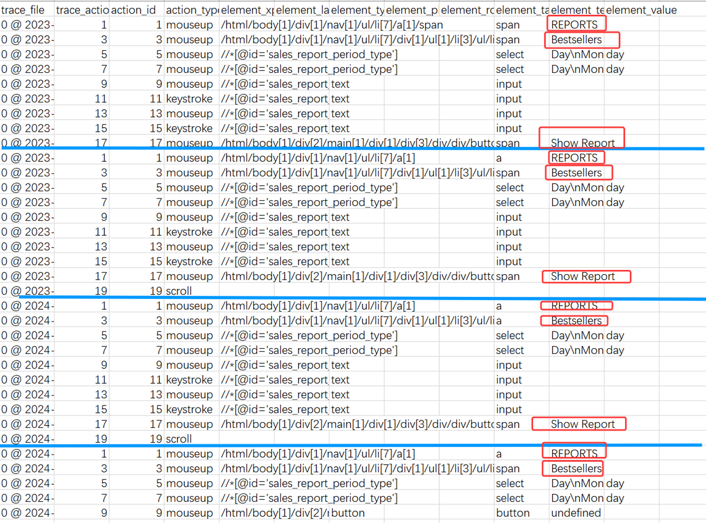
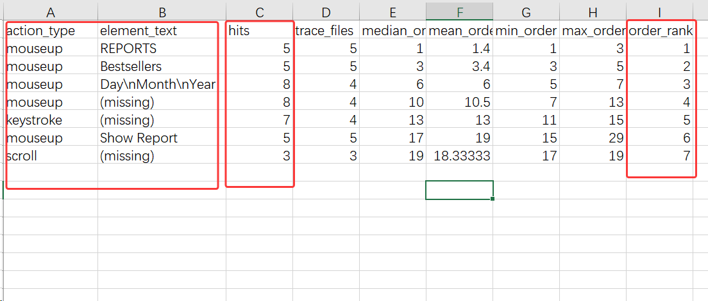
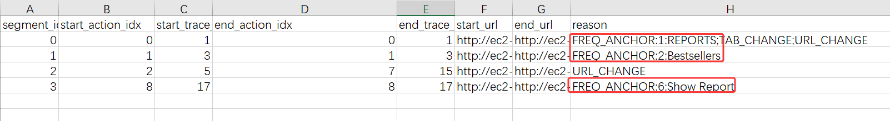

# Action2Event

对于数据集的处理
数据集使用wonderbread中的gold_demos_sop_trace_only数据，包含有162个子任务

每个任务包含5条左右的trajectory
在segment.py，按照人为设定的规则进行划分，但是效果一般，url/tab的切换是明显的，但是别的存在缺陷
所以

每个任务包含5条左右的trajectory
在segment.py，按照人为设定的规则进行划分，但是效果一般，url/tab的切换是明显的，但是别的存在缺陷，导致不能很好的划分。如下图，可以看到仅分为了3段

所以在rawdata_analysis文件中，先对json中的关键信息做提取，此时人类就可以一下看出高频的操作；于是再统计其中的高频action

统计后的结果

此时再通过segmentfreq.py进行划分 ，将统计出来的频率作为anchor

